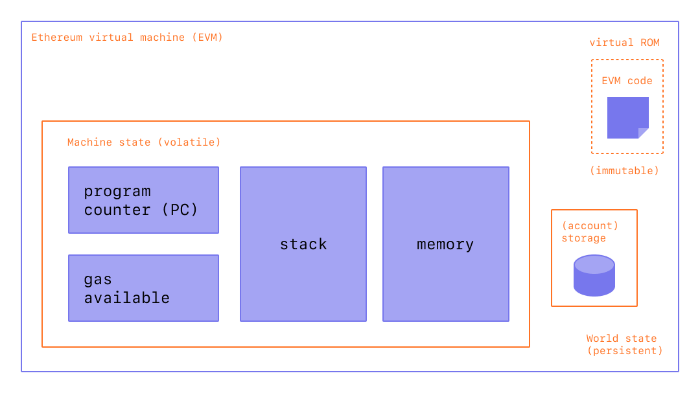

Instansiasi fisik EVM tidak dapat dideskripsikan dengan cara yang sama seperti seseorang menunjuk ke awan atau gelombang laut, tetapi _ada_ sebagai satu entitas tunggal yang dikelola oleh ribuan komputer terhubung yang menjalankan klien Ethereum.

Protokol Ethereum itu sendiri ada semata-mata untuk tujuan menjaga operasi yang berkelanjutan, tidak terputus, dan tidak dapat diubah dari mesin state khusus ini; Ini adalah lingkungan di mana semua akun Ethereum dan kontrak pintar tinggal. Pada blok mana pun dalam rantai, Ethereum memiliki satu dan hanya satu state 'kanonis', dan EVM adalah yang mendefinisikan aturan untuk menghitung state valid baru dari blok ke blok.

## Prasyarat {#prerequisites}

Beberapa pemahaman dasar tentang terminologi umum dalam ilmu komputer seperti [bita](https://en.wikipedia.org/wiki/Byte), [memori](https://en.wikipedia.org/wiki/Computer_memory), dan [tumpukan](<https://en.wikipedia.org/wiki/Stack_(abstract_data_type)>) diperlukan untuk memahami EVM. Akan sangat membantu jika Anda merasa nyaman dengan konsep kriptografi/blockchain seperti [fungsi hash](https://en.wikipedia.org/wiki/Cryptographic_hash_function), [bukti kerja](https://en.wikipedia.org/wiki/Proof_of_work) dan [Pohon Merkle](https://en.wikipedia.org/wiki/Merkle_tree).

## Dari buku besar ke mesin state {#from-ledger-to-state-machine}

Analogi dari 'buku besar terdistribusi' sering digunakan untuk menggambarkan blockchain seperti Bitcoin, yang memungkinkan mata uang terdesentralisasi menggunakan peralatan dasar kriptografi. Mata uang kripto berperilaku seperti mata uang 'biasa' karena aturan yang mengatur apa yang bisa dan tidak bisa dilakukan untuk memodifikasi buku besar. Misalnya, alamat Bitcoin tidak dapat membelanjakan lebih banyak Bitcoin daripada yang diterima sebelumnya. Aturan ini mendukung semua transaksi di Bitcoin dan banyak blockchain lainnya.

Meskipun Ethereum memiliki mata uang kripto (Ether) asli sendiri yang mengikuti aturan intuitif yang hampir sama persis, Ethereum juga memungkinkan fungsi yang jauh lebih kuat: [kontrak pintar](/developers/docs/smart-contracts/). Untuk fitur yang lebih kompleks ini, diperlukan analogi yang lebih canggih. Alih-alih buku besar terdistribusi, Ethereum adalah [mesin state](https://en.wikipedia.org/wiki/Finite-state_machine) yang terdistribusi. State Ethereum adalah struktur data yang sangat besar yang menyimpan tidak hanya semua akun dan saldo, tapi _state mesin_, yang bisa mengubah blok ke blok sesuai dengan serangkaian aturan yang telah ditetapkan sebelumnnya, dan bisa menjalankan kode mesin arbitrari. Aturan spesifik tentang mengubah state dari blok ke blok ditentukan oleh EVM.

 _Diagram diadaptasi dari [Ethereum EVM yang diilustrasikan](https://takenobu-hs.github.io/downloads/ethereum_evm_illustrated.pdf)_

## Fungsi transisi state Ethereum {#the-ethereum-state-transition-function}

EVM bertindak seperti fungsi matematika: Jika menerima input, akan menghasilkan output deterministik. Oleh karena itu cukup membantu mendeskripsikan Ethereum dengan lebih formal sebagai memiliki **fungsi transaksi state**:

```
Y(S, T)= S'
```

Dengan state valid versi lama `(S)` dan kumpulan baru dari transaksi valid `(T)`, fungsi transisi Ethereum `Y(S, T)` menghasilkan state output valid yang baru `S'`

### State {#state}

Dalam konteks Ethereum, state adalah struktur data yang sangat besar yang disebut [Pohon Merkle Patricia yang dimodifikasi](https://eth.wiki/en/fundamentals/patricia-tree), yang menyimpan semua [akun](/developers/docs/accounts/) yang ditautkan oleh hash dan dapat direduksi menjadi satu hash root yang disimpan pada blockchain.

### Transaksi {#transactions}

Transaksi adalah instruksi yang ditandatangani secara kriptografik dari akun. Ada dua jenis transaksi: transaksi yang menghasilkan pemanggilan pesan dan transaksi yang menghasilkan pembuatan kontrak.

Pembuatan kontrak menghasilkan pembuatan akun kontrak baru yang berisi kode bita [kontrak pintar](/developers/docs/smart-contracts/anatomy/) yang dikompilasi. Setiap kali akun lain melakukan pemanggilan pesan ke kontrak itu, akun itu akan mengeksekusi kode bitanya.

## Instruksi EVM {#evm-instructions}

EVM beroperasi sebagai [mesin tumpukan](https://en.wikipedia.org/wiki/Stack_machine) dengan kedalaman 1024 item. Setiap item adalah kata berukuran 256 bit, yang dipilih untuk kemudahan penggunaan dengan kriptografi 256 bit (seperti hash Keccak-256 atau tanda tangan secp256k1).

Saat pengoperasian, EVM mempertahankan _memori_ sementara (sebagai himpunan bita kata yang dirujuk), yang tidak bertahan di antara transaksi.

Akan tetapi, kontrak berisi pohon _penyimpanan_ Merkle Patricia (sebagai himpunan kata yang dapat dirujuk), yang terkait dengan akun yang sedang dipertanyakan dan merupakan bagian dari state global.

Kode bita kontrak pintar yang dikompilasi dieksekusi sebagai nomor EVM [opcode](/developers/docs/evm/opcodes), yang melakukan operasi tumpukan standar seperti `XOR`, `AND`, `ADD`, `SUB`, dll. EVM juga menerapkan sejumlah operasi tumpukan khusus blockchain, seperti `ADDRESS`, `BALANCE`, `BLOCK HASH`, dll.

 _Diagram diadaptasi dari [Ethereum EVM yang diilustrasikan](https://takenobu-hs.github.io/downloads/ethereum_evm_illustrated.pdf)_

## Implementasi EVM {#evm-implementations}

Semua implementasi EVM harus sesuai dengan spesifikasi yang dideskripsikan dalam Yellowpaper Ethereum.

Dalam riwayat 5 tahun Ethereuem, EVM telah menjalani beberapa revisi, dan ada beberapa implementasi EVM dalam bahasa pemrograman yang beragam.

Semua [klien Ethereum](/developers/docs/nodes-and-clients/#execution-clients) mencakup implementasi EVM. Selain itu, ada beberapa implementasi mandiri, yang meliputi:

- [Py-EVM](https://github.com/ethereum/py-evm) - _Python_
- [evmone](https://github.com/ethereum/evmone) - _C++_
- [ethereumjs-vm](https://github.com/ethereumjs/ethereumjs-vm) - _JavaScript_
- [eEVM](https://github.com/microsoft/eevm) - _C++_
- [Hyperledger Burrow](https://github.com/hyperledger/burrow) - _Go_
- [hevm](https://github.com/dapphub/dapptools/tree/master/src/hevm) - _Haskell_

## Bacaan Lebih Lanjut {#further-reading}

- [Yellowpaper Ethereum](https://ethereum.github.io/yellowpaper/paper.pdf)
- [Jellopaper aka KEVM: Semantik EVM dalam K](https://jellopaper.org/)
- [The Beigepaper](https://github.com/chronaeon/beigepaper)
- [Opcode Mesin Virtual Ethereum](https://www.ethervm.io/)
- [Pengantar singkat dalam dokumentasi Solidity](https://docs.soliditylang.org/en/latest/introduction-to-smart-contracts.html#index-6)

## Topik Terkait {#related-topics}

- [Gas](/developers/docs/gas/)
