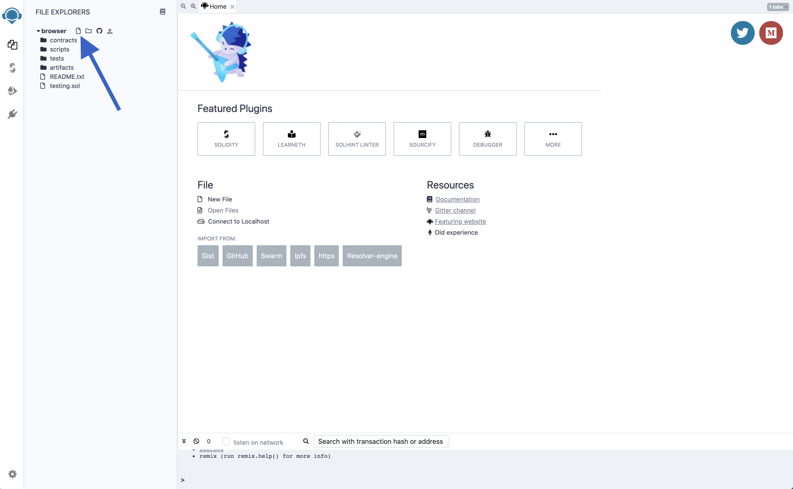
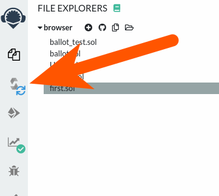
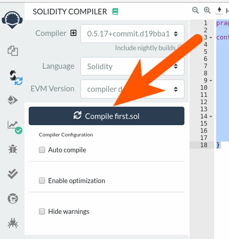
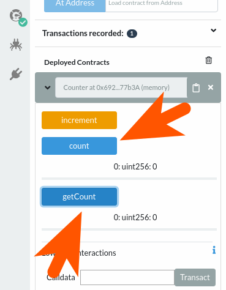
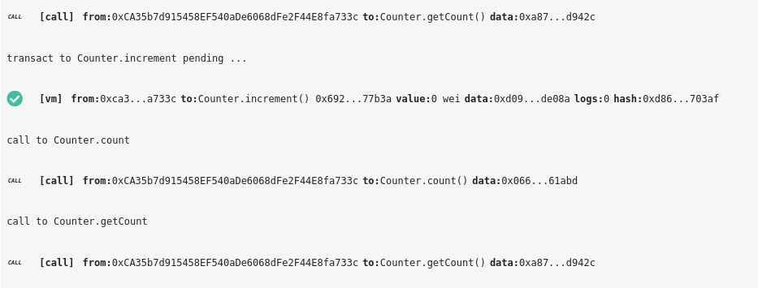
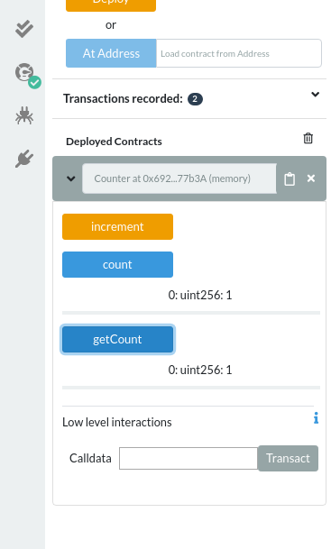

Cred că ești la fel de entuziasmat ca noi să [implementezi](/developers/docs/smart-contracts/deploying/) și să interacționezi cu primul tău [contract inteligent](/developers/docs/smart-contracts/) pe blockchain-ul Ethereum.

Nu-ți face griji, deoarece este primul nostru contract inteligent, îl vom implementa într-o [rețea de testare locală](/developers/docs/networks/), astfel încât să nu te coste nimic pentru a-l implementa și juca atât cât dorești cu el.

## Scrierea contractului nostru {#writing-our-contract}

Primul pas este să vizitezi [Remix](https://remix.ethereum.org/) și să creezi un fișier nou. În partea din stânga de sus a interfeței Remix, adaugă un nou fișier și introdu numele fișierului dorit.



În noul fișier, vom lipi următorul cod.

```solidity
pragma solidity 0.5.17;

contract Counter {

    // Variabilă publică de tip int nesemnat pentru a păstra numărul de contorizări
    uint256 public count = 0;

    // Funcție care incrementează contorul nostru
    function increment() public {
        count += 1;
    }

    //Nu este necesar getter pentru a obține valoarea de numărare
    function getCount() public view returns (uint256) {
        return count;
    }

}
```

Dacă ești obișnuit cu programarea poți ghici cu ușurință ce face acest program. Iată un explicator rând cu rând:

- Linia 3: Definim un contract cu numele `Counter`.
- Linia 6: Contractul nostru stochează un număr întreg nesemnat numit `count` începând de la 0.
- Linia 9: Prima funcție va modifica starea contractului și `increment()` variabila noastră `count`.
- Linia 14: A doua funcție este doar un getter pentru a putea citi valoarea variabilei `count` în afara contractului inteligent. Reține că, așa cum am definit variabila noastră `count` ca fiind publică, aceasta nu este necesară, dar este prezentată ca exemplu.

Acesta este primul nostru contract inteligent simplu. După cum probabil știi, arată ca o clasă din limbajele OOP, cum ar fi Java sau C++. Acum este timpul să ne jucăm cu contractul nostru.

## Implementarea contractului {#deploying-our-contract}

După ce am scris primul nostru contract inteligent, îl implementăm în blockchain pentru a putea să ne jucăm cu el.

[Implementarea contractului inteligent în blockchain](/developers/docs/smart-contracts/deploying/) este de fapt doar trimiterea unei tranzacții care conține codul contractului inteligent compilat, fără a specifica niciun destinatar.

Mai întâi vom [compila contractul](/developers/docs/smart-contracts/compiling/) făcând clic pe pictograma compilare din partea stângă:



Apoi facem clic pe butonul compilare:



Poți alege opțiunea „Compilare automată”, astfel încât contractul să fie întotdeauna compilat când salvezi conținutul pe editorul de text.

Apoi navighează la „deploy” și rulează ecranul de tranzacții:


Odată ce te afli în ecranul de tranzacții „implementare și executare”, verifică din nou dacă numele contractului tău apare și fă clic pe „Deploy”. După cum poți vedea în partea de sus a paginii, mediul actual este „JavaScript VM”, ceea ce înseamnă că vom implementa și interacționa cu contractul nostru inteligent pe un blockchain de test local pentru a putea testa mai rapid și fără taxe.


După ce ai făcut clic pe butonul „Deploy”, vei vedea contractul tău în partea de jos. Fă clic pe săgeata din stânga pentru a o extinde, astfel încât să vedem conținutul contractului nostru. Aceasta este variabila `counter`, funcția noastră `increment()` și getter-ul `getCounter()`.

Dacă faci clic pe butonul `count` sau `getCount`, acesta va prelua conținutul variabilei `count` a contractului și o va afișa. Deoarece nu am apelat încă funcția `increment`, ar trebui să afișeze 0.



Să apelăm acum funcția `increment` făcând clic pe buton. Vei vedea jurnalele tranzacțiilor efectuate care apar în partea de jos a ferestrei. Vei vedea că jurnalele sunt diferite atunci când apeși butonul pentru a prelua datele în loc de butonul `increment`. Acest lucru se datorează faptului că citirea datelor pe blockchain nu are nevoie de tranzacții (scriere) sau taxe. Deoarece doar modificarea stării blockchain-ului necesită efectuarea unei tranzacții:



După apăsarea butonului de incrementare, care va genera o tranzacție pentru a apela funcția noastră `increment()`, dacă facem clic din nou pe butoanele count sau getCount, vom citi noua stare actualizată a contractului nostru inteligent, cu variabila count mai mare de 0.



În tutorialul următor, vom acoperi [cum poți adăuga evenimente la contractele tale inteligente](/developers/tutorials/logging-events-smart-contracts/). Înregistrarea evenimentelor este o modalitate convenabilă de a depana contractul inteligent și de a înțelege ce se întâmplă în timp ce apelezi o funcție.
